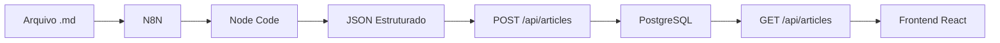

# Blog de Medicina de Emergência - React.js

Um blog moderno e responsivo desenvolvido em React.js com Tailwind CSS, focado em conteúdo médico de emergência e medicina intensiva.

## 🚀 Características Principais

Este projeto implementa um blog completo com todas as funcionalidades especificadas na hierarquia fornecida, incluindo navegação intuitiva, busca interativa, e design profissional baseado no mockup.

### Funcionalidades Implementadas

**Página Principal:**
- Header com gradiente e menu de navegação responsivo
- Banner de estatísticas e link para equipe
- Card de destaque com badge de tempo de leitura
- Sistema de busca com filtro em tempo real
- Grid de grandes temas com cores personalizadas
- Seção de procedimentos
- Bloco de contato WhatsApp
- Badge de newsletter com contador de assinantes
- Lista de conteúdos mais clicados
- Bloco promocional com certificações

**Página de Artigo:**
- Header com título e data de atualização
- Navegação por seções do artigo
- Conteúdo estruturado com parágrafos
- Tabela de destaque estilizada
- Sistema de navegação entre seções

### Design e Estilos

O projeto segue fielmente o mockup fornecido, implementando:
- Cores específicas: `#ff7e82` (destaque) e `#d9d9d9` (bordas)
- Cantos arredondados em cards e tabelas
- Gradientes e sombras modernas
- Transições suaves e hover effects
- Layout responsivo para diferentes dispositivos

## 🛠️ Tecnologias Utilizadas

- **React.js** - Framework principal
- **Tailwind CSS** - Estilização e design system
- **Lucide React** - Ícones modernos
- **Vite** - Build tool e servidor de desenvolvimento
- **shadcn/ui** - Componentes de interface

## 📦 Instalação e Execução

### Pré-requisitos
- Node.js (versão 18 ou superior)
- pnpm (gerenciador de pacotes)

### Passos para execução

1. **Instalar dependências:**
   ```bash
   pnpm install
   ```

2. **Iniciar servidor de desenvolvimento:**
   ```bash
   pnpm run dev
   ```

3. **Acessar a aplicação:**
   Abra o navegador em `http://localhost:5173`

### Scripts Disponíveis

- `pnpm run dev` - Inicia o servidor de desenvolvimento
- `pnpm run build` - Gera build de produção
- `pnpm run preview` - Visualiza build de produção
- `pnpm run lint` - Executa linting do código

## 📁 Estrutura do Projeto

```
src/
├── components/           # Componentes React
│   ├── Header.jsx       # Cabeçalho principal
│   ├── PageTitle.jsx    # Título das páginas
│   ├── FeaturedPostCard.jsx  # Card de destaque
│   ├── TopicSearch.jsx  # Busca por tópicos
│   ├── TaxonomyGrid.jsx # Grid de grandes temas
│   ├── SectionHeading.jsx    # Cabeçalhos de seção
│   ├── TextBlock.jsx    # Bloco de texto
│   ├── NewsletterBadge.jsx   # Badge de newsletter
│   ├── MostClicked.jsx  # Lista mais clicados
│   ├── PromoBlock.jsx   # Bloco promocional
│   ├── ArticleHeader.jsx     # Cabeçalho de artigos
│   ├── ArticleNav.jsx   # Navegação de artigos
│   ├── ArticleBody.jsx  # Corpo do artigo
│   └── ui/              # Componentes base (shadcn/ui)
├── App.jsx              # Componente principal
├── main.jsx             # Ponto de entrada
└── index.css            # Estilos globais
```

## 🎨 Componentes Principais

### Header
Cabeçalho completo com título, slogan, menu de navegação e banner de estatísticas.

### TopicSearch
Sistema de busca interativo que filtra tópicos em tempo real conforme o usuário digita.

### TaxonomyGrid
Grid de grandes temas com cores personalizadas e efeitos hover.

### ArticleNav
Navegação por seções do artigo com indicador visual da seção ativa.

### MostClicked
Lista numerada dos conteúdos mais acessados com ícones e hover effects.

## 🔧 Personalização

### Cores
As cores principais podem ser ajustadas no arquivo `src/index.css`:
- `#ff7e82` - Cor de destaque (fundo de cards especiais)
- `#d9d9d9` - Cor de bordas
- `#ef4444` - Cor primária (vermelho)

### Conteúdo
Os dados dos componentes estão definidos diretamente nos arquivos. Para um projeto real, recomenda-se:
- Implementar um sistema de CMS
- Conectar com APIs de conteúdo
- Adicionar sistema de autenticação

## 📱 Responsividade

O projeto é totalmente responsivo, adaptando-se a:
- Desktop (1024px+)
- Tablet (768px - 1023px)
- Mobile (até 767px)

## 🚀 Deploy

Para fazer deploy da aplicação:

1. **Gerar build de produção:**
   ```bash
   pnpm run build
   ```

2. **Os arquivos estarão na pasta `dist/`**

3. **Fazer upload para seu servidor ou plataforma de hospedagem**

## 📄 Licença

Este projeto foi desenvolvido como demonstração técnica baseada em especificações fornecidas.

## 🤝 Contribuição

Para contribuir com o projeto:
1. Faça um fork do repositório
2. Crie uma branch para sua feature
3. Commit suas mudanças
4. Abra um Pull Request

---

**Desenvolvido com ❤️ usando React.js e Tailwind CSS**


# 🏥 Backend Blog Médico - Liberdade Médica

API REST completa para o blog médico, desenvolvida em Node.js com PostgreSQL, otimizada para receber dados processados pelo N8N e servir o frontend React.

## 🚀 Características Principais

- **API REST completa** com endpoints para artigos médicos
- **Integração PostgreSQL** com queries otimizadas e índices
- **Cache inteligente** com Node-Cache para performance
- **Busca textual avançada** com PostgreSQL Full-Text Search
- **Rate limiting** e segurança com Helmet
- **Validação robusta** com Express Validator
- **Logs estruturados** com Morgan e Winston
- **Health checks** e monitoramento

## 📋 Pré-requisitos

- **Node.js** 18+ 
- **PostgreSQL** 12+
- **npm** ou **yarn**

## 🛠️ Instalação e Configuração

### 1. Clonar e Instalar Dependências

```bash
cd backend-blog-medico
npm install
```

### 2. Configurar Banco de Dados

```bash
# Conectar ao PostgreSQL
psql -h 35.199.101.38 -p 5432 -U vinilean -d liberdade-medica

# Executar script de criação das tabelas
\i database_structure.sql
```

### 3. Configurar Variáveis de Ambiente

```bash
# Copiar arquivo de exemplo
cp .env.example .env

# Editar configurações (já pré-configurado para seu banco)
nano .env
```

### 4. Iniciar Servidor

```bash
# Desenvolvimento (com hot reload)
npm run dev

# Produção
npm start
```

## 🗄️ Estrutura do Banco de Dados

### Tabela Principal: `artigos`

```sql
CREATE TABLE artigos (
    id SERIAL PRIMARY KEY,
    titulo VARCHAR(255) NOT NULL,
    slug VARCHAR(255) UNIQUE NOT NULL,
    categoria VARCHAR(100) NOT NULL,
    autor VARCHAR(100) NOT NULL,
    resumo TEXT,
    conteudo_completo TEXT NOT NULL,
    em_1_minuto JSONB,           -- Resumo estruturado
    secoes JSONB,                -- Seções numeradas do artigo
    faq JSONB,                   -- Perguntas e respostas
    referencias JSONB,           -- Bibliografia
    tags TEXT[],                 -- Array de tags
    tempo_leitura INTEGER,       -- Em minutos
    destaque BOOLEAN DEFAULT FALSE,
    visualizacoes INTEGER DEFAULT 0,
    search_vector tsvector,      -- Para busca textual
    created_at TIMESTAMP DEFAULT NOW()
);
```

### Tabelas Auxiliares

- **categorias**: Gestão de categorias médicas
- **autores**: Informações dos autores
- **tags**: Sistema de tags
- **estatisticas**: Métricas de acesso
- **newsletter**: Assinantes da newsletter
- **mais_clicados**: Cache de artigos populares

## 🔌 Endpoints da API

### 📚 Artigos

| Método | Endpoint | Descrição |
|--------|----------|-----------|
| `GET` | `/api/articles` | Listar artigos com filtros |
| `GET` | `/api/articles/:id` | Buscar por ID |
| `GET` | `/api/articles/:slug` | Buscar por slug |
| `GET` | `/api/articles/featured` | Artigos em destaque |
| `GET` | `/api/articles/most-clicked` | Mais clicados |
| `GET` | `/api/articles/search` | Busca avançada |
| `GET` | `/api/articles/category/:categoria` | Por categoria |
| `GET` | `/api/articles/stats` | Estatísticas |
| `POST` | `/api/articles` | Criar artigo |
| `PUT` | `/api/articles/:id` | Atualizar artigo |
| `DELETE` | `/api/articles/:id` | Arquivar artigo |

### 🔍 Exemplos de Uso

#### Listar Artigos com Filtros
```bash
GET /api/articles?categoria=Medicina%20de%20Emergência&destaque=true&limit=10
```

#### Busca Textual
```bash
GET /api/articles/search?q=sepse&categoria=Emergência
```

#### Artigo por Slug
```bash
GET /api/articles/protocolo-sepse-emergencia
```

## 🔧 Integração com N8N

### Fluxo de Processamento

1. **N8N recebe arquivo .md**
2. **Processa com node code** (usar `/n8n_node_code.js`)
3. **Envia JSON para API** via POST `/api/articles`

### Exemplo de Payload do N8N

```json
{
  "titulo": "Protocolo de Sepse em Medicina de Emergência",
  "categoria": "Medicina de Emergência",
  "autor": "Dr. João Silva",
  "resumo": "Protocolo completo para diagnóstico...",
  "conteudo_completo": "# Protocolo de Sepse...",
  "em_1_minuto": {
    "o_que_e": "Disfunção orgânica...",
    "gravidade": "Alta mortalidade...",
    "conduta_inicial": "Protocolo de sepse...",
    "exame_principal": "Lactato sérico...",
    "quando_internar": "Sempre...",
    "riscos": "Choque séptico..."
  },
  "secoes": {
    "secao_1": {
      "numero": 1,
      "titulo": "O que é Sepse?",
      "conteudo": "Sepse é uma resposta..."
    }
  },
  "faq": [
    {
      "pergunta": "Sepse e infecção são a mesma coisa?",
      "resposta": "Não. Infecção é o gatilho..."
    }
  ],
  "referencias": [
    "Surviving Sepsis Campaign 2021",
    "Sepsis-3 Consensus"
  ],
  "tags": ["sepse", "emergência", "protocolo"],
  "tempo_leitura": 15,
  "destaque": true
}
```

## 🎯 Integração com Frontend React

### Configuração no Frontend

```javascript
// src/services/api.js
const API_BASE_URL = 'http://localhost:3001/api';

export const articleService = {
  // Buscar todos os artigos
  getAll: (filters = {}) => 
    fetch(`${API_BASE_URL}/articles?${new URLSearchParams(filters)}`),
  
  // Buscar por slug
  getBySlug: (slug) => 
    fetch(`${API_BASE_URL}/articles/${slug}`),
  
  // Artigos em destaque
  getFeatured: () => 
    fetch(`${API_BASE_URL}/articles/featured`),
  
  // Mais clicados
  getMostClicked: () => 
    fetch(`${API_BASE_URL}/articles/most-clicked`)
};
```

### Exemplo de Uso no React

```jsx
// src/components/ArticleList.jsx
import { useState, useEffect } from 'react';
import { articleService } from '../services/api';

function ArticleList() {
  const [articles, setArticles] = useState([]);
  const [loading, setLoading] = useState(true);

  useEffect(() => {
    const fetchArticles = async () => {
      try {
        const response = await articleService.getAll({
          categoria: 'Medicina de Emergência',
          limit: 10
        });
        const data = await response.json();
        setArticles(data.data);
      } catch (error) {
        console.error('Erro ao buscar artigos:', error);
      } finally {
        setLoading(false);
      }
    };

    fetchArticles();
  }, []);

  if (loading) return <div>Carregando...</div>;

  return (
    <div>
      {articles.map(article => (
        <div key={article.id}>
          <h3>{article.titulo}</h3>
          <p>{article.resumo}</p>
          <span>{article.categoria}</span>
        </div>
      ))}
    </div>
  );
}
```

## 🔒 Segurança e Performance

### Medidas Implementadas

- **Rate Limiting**: 1000 req/15min global, 30 req/min busca
- **Helmet**: Headers de segurança
- **CORS**: Configurado para domínios específicos
- **Validação**: Express Validator em todas as entradas
- **Cache**: Node-Cache com TTL de 5 minutos
- **SQL Injection**: Queries parametrizadas
- **Compressão**: Gzip habilitado

### Índices de Performance

```sql
-- Índices criados automaticamente
CREATE INDEX idx_artigos_categoria ON artigos(categoria);
CREATE INDEX idx_artigos_search ON artigos USING GIN(search_vector);
CREATE INDEX idx_artigos_tags ON artigos USING GIN(tags);
```

## 📊 Monitoramento e Logs

### Health Check

```bash
GET /health
```

Retorna status do servidor e banco de dados.

### Logs Estruturados

- **Desenvolvimento**: Logs coloridos no console
- **Produção**: Logs em formato JSON
- **Queries lentas**: Alertas para queries > 1s

## 🚀 Deploy e Produção

### Variáveis de Ambiente Produção

```bash
NODE_ENV=production
PORT=3001
DB_HOST=35.199.101.38
DB_SSL=true
RATE_LIMIT_GLOBAL=5000
CACHE_TTL=600
```

### Scripts Disponíveis

```bash
npm start          # Iniciar em produção
npm run dev        # Desenvolvimento com nodemon
npm run test       # Executar testes
npm run lint       # Verificar código
npm run db:migrate # Executar migrações
```

## 🔄 Fluxo Completo N8N → Backend → Frontend



## 📞 Suporte e Contato

- **Documentação**: `GET /api/docs`
- **Health Check**: `GET /health`
- **Logs**: Console ou arquivo conforme configuração

---

**Desenvolvido para Liberdade Médica** 🏥  
Backend otimizado para performance e integração com N8N e React.
